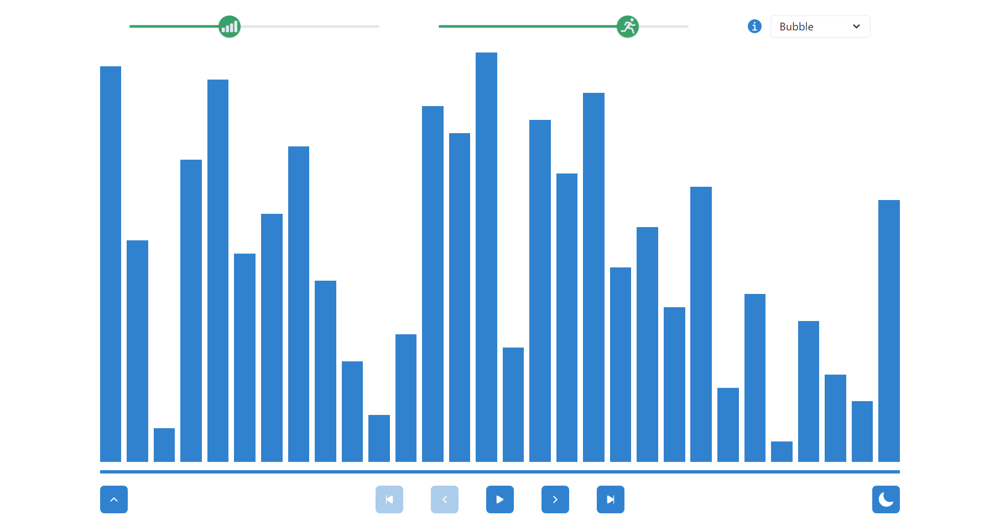
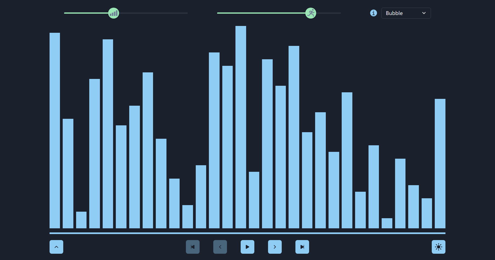
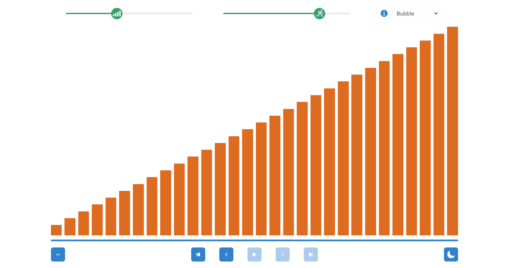
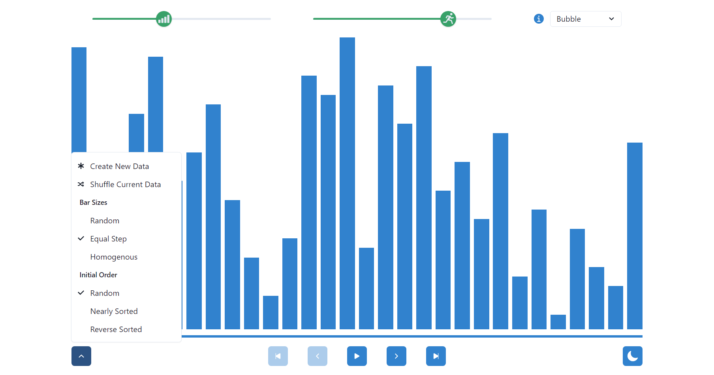
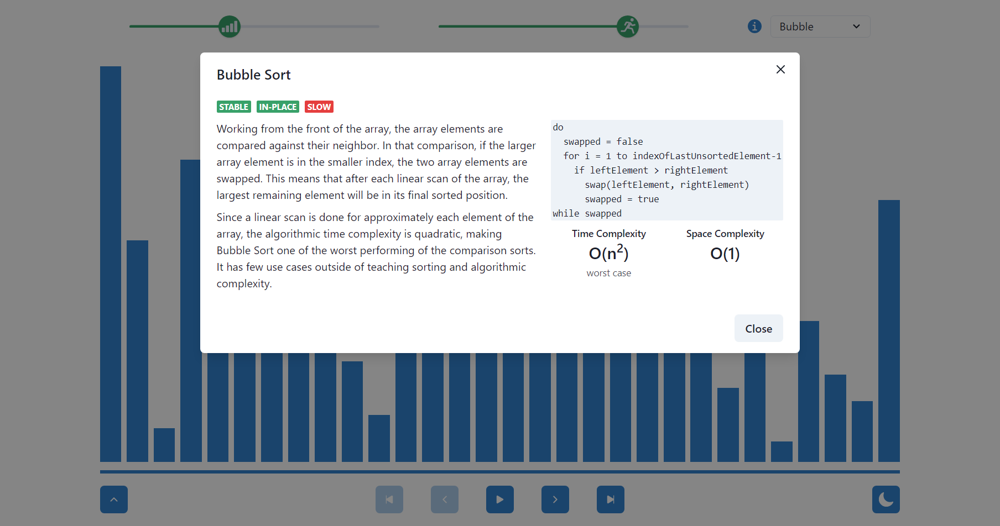
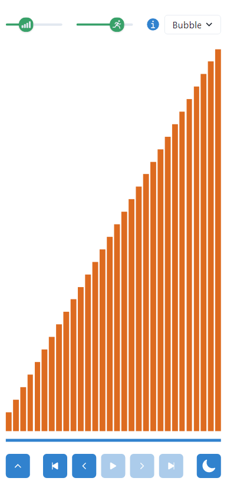

# Sorting Visualizer <!-- omit in toc -->

- [Description](#description)
- [Technologies Used](#technologies-used)
- [Usage](#usage)

## Description

The Sorting Visualizer is a learning tool for Computer Science gurus and novices alike! By manipulating the intuitive controls, users can choose between seven different sorts, start and stop the animation, slow the animation speed, and much more! The Sorting Visualizer if a fully front-end application with no shortage of options and applications for use. Check out the deployed application at https://glendonintendo.github.io/sorting-visualizer/.

## Technologies Used
The Sorting Visualizer is a fully front-end application. React is used to dynamically update the webpage in response to user input. 

Chakra UI is a component library that provided many of the basic components used in the application.

And of course, vanilla JavaScript is the seam that creates the sorting logic and holds the whole application together.

## Usage

Iconography and intuitive user controls were used to provide a seamless user experience.

The top navigation provides different options for the visualizer. From left to right:
- The two sliders control the amount of bars that appear in the visualizer and the speed of the animation. 
- The information icon will open a modal with information on the selected sort.
- The drop down menu allows for users to choose between different types of sorts.

The bottom bar is the controller for the visualizer. Users can start, stop, step forward and backward, and set the visualizer to the beginning and end animations. From left to right:
- The array options menu allows the user to create new data sets in variety of starting states as well as shuffle the current data set.
- The middle five icons are the controller for the animation. In order, they allow the player to skip to the first animation, step back one animation, play/pause the animations, step forward one animation, and skip to the last animation.
- The sun/moon button will allow users to switch between light and dark mode.

Users can switch between dark and light mode for a different visual experience.

Users can manipulate the controls to show the animation, change the amount of bars in the visualizer, and slow the animation down.

Users can change the characteristics of the data set. Switching between sorts can show how sorts perform different based on the original data set.

Users can get additional information about sorts including time and space complexity, pseudocode, and use cases.

The app was developed using mobile-first, UX, and accessibility methodologies for a universally exceptional experience.
